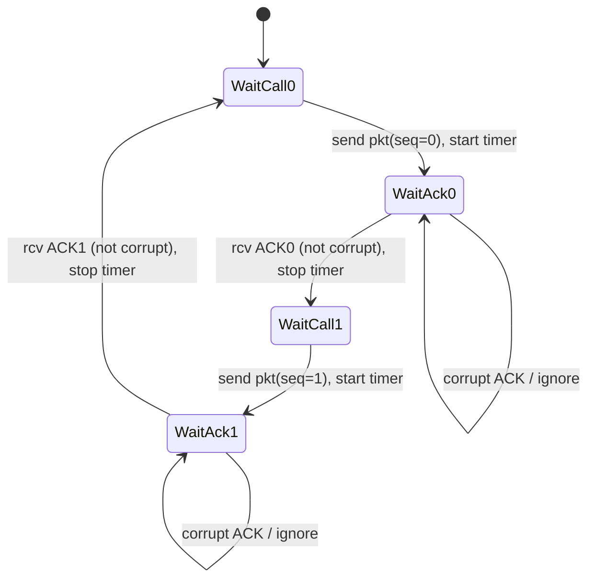
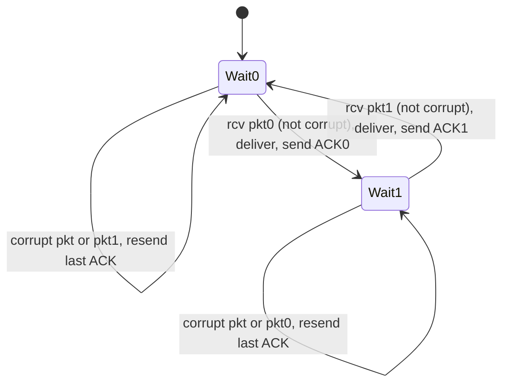
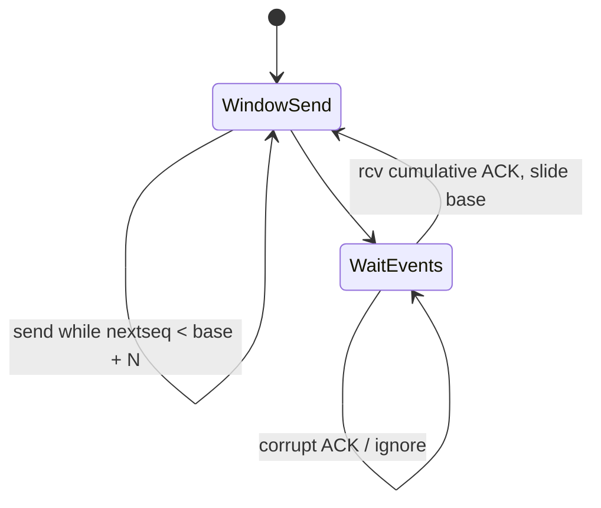
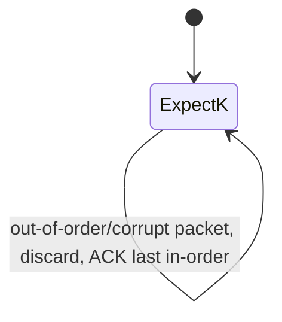
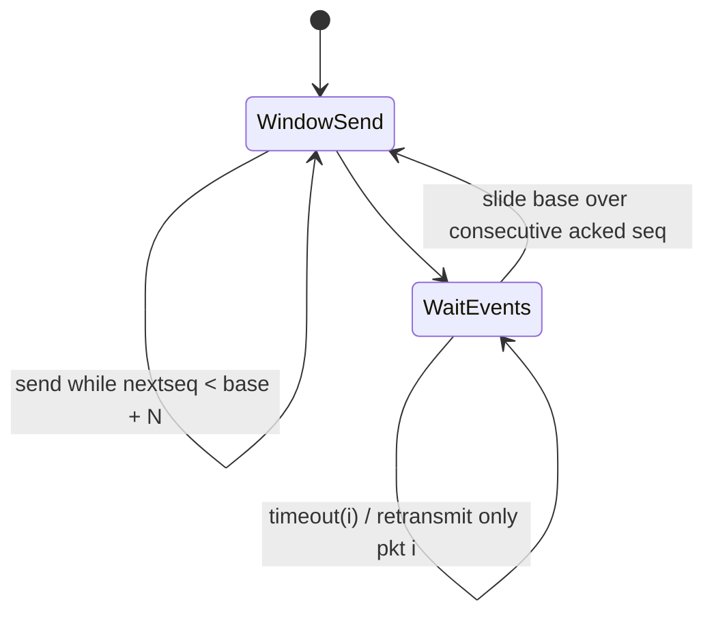
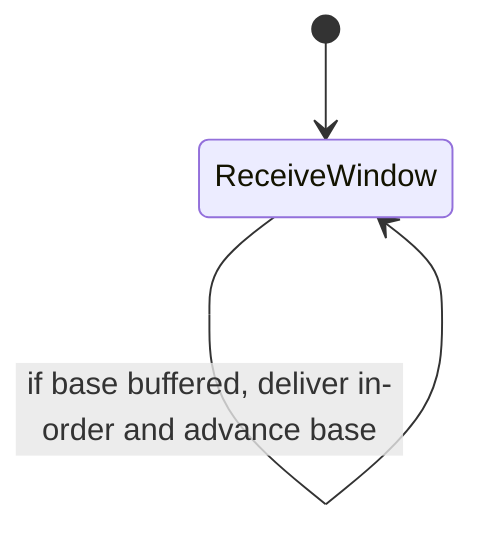

# Report: Reliable Data Transfer Protocols

## Student Details

- Student ID: (fill here)
- Name: (fill here)
- Section: (fill here)

## Objective

Implement and test:

- rdt 3.0 (Stop-and-Wait)
- Go-Back-N (GBN)
- Selective Repeat (SR)

The channel is unreliable and may drop packets, corrupt packets, or delay packets.

## Design Summary

- A discrete-event simulator is used.
- Both data and ACK packets pass through the same unreliable network model.
- Sender and receiver logic for each protocol follows finite-state-machine behavior.
- Sequence numbers are used to ensure reliable in-order delivery.
- Packet size and packet count are configurable from the command line.

## FSM Diagrams

### rdt 3.0 Sender



### rdt 3.0 Receiver



### GBN Sender



### GBN Receiver



### SR Sender



### SR Receiver



## Testing Scenarios

The simulator includes these required scenarios:

1. No packet loss/corruption
2. Packet loss
3. Packet corruption
4. Delayed packets

Command used:

```bash
python main.py --protocol all --count 12 --size 16 --window 4 --timeout 8 --run-assignment-tests
```

## Observations

- rdt 3.0 works reliably but has lower throughput since only one packet is in-flight.
- GBN improves throughput using pipelining, but timeout causes retransmission of an entire suffix of the window.
- SR improves retransmission efficiency by resending only timed-out packets and buffering out-of-order packets at the receiver.
- In all tested scenarios, each protocol recovers and eventually delivers all packets in order.

## How to Run

See `README.md` for commands and options.
